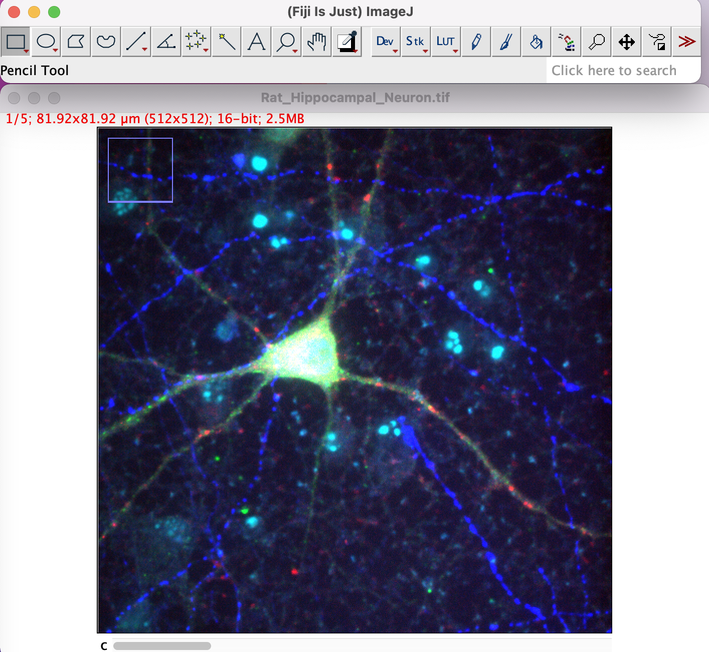
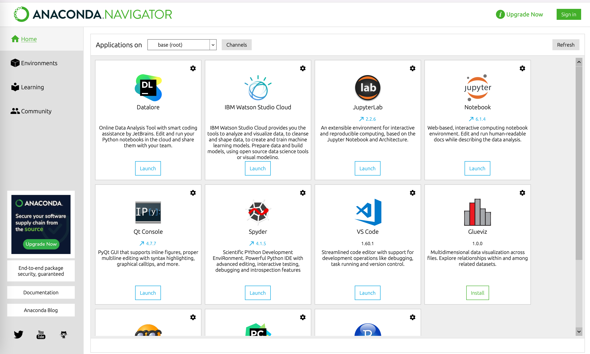

# Introduction to Bioimage analysis for the DZNE Tuebingen workshop (30th and 31st May 2022)

## In preparation for the workshop please install in advance:

- FIJI: https://imagej.net/software/fiji/

- CellProfiler: https://cellprofiler.org/releases

- CellProfiler Analyst: https://cellprofileranalyst.org/releases

- Python/Anaconda installation (optional): https://docs.anaconda.com/anaconda/install/

## Download or use Git to clone this repository: 
  

You can use `Download ZIP` or Git: `git clone https://github.com/amgfernandes/Workshop_May_2022_Tuebingen.git`

## Download Demo data:

https://nextcloud.dzne.de/index.php/s/ZGyWa5QZiNTnJbW
- password will be sent by email

Link to IMARIS learning center as reference:
https://imaris.oxinst.com/learning/?businesses=bitplane&media=VideoTutorials

## Bioimage Analysis: Recommended Reading and Viewing:
- Python: Basics for Data Scientists --> https://github.com/FabrizioMusacchio/Python_Course
- Introduction to Bioimage Analysis --> https://bioimagebook.github.io/README.html
- Introduction to Bioimage Analysis video --> https://www.ibiology.org/techniques/introduction-to-bioimage-analysis/
- Bioimage analysis for computational biology --> https://github.com/BiAPoL/Bio-image_Analysis_with_Python
- Introduction to Image Analysis with FIJI --> https://www.crick.ac.uk/sites/default/files/2018-07/Introduction%20to%20image%20analysis%20with%20FIJI_David%20Berry_TheFrancisCrickInstitute_0.pdf
- ML for Bioimage analysis --> https://montpellierressourcesimagerie.github.io/mri-workshop-machine-learning/slides_day1.revealjs.htm#/3
