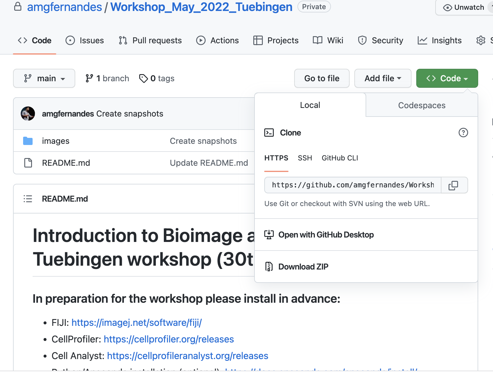

# Introduction to Bioimage analysis for the DZNE Tuebingen workshop (30th and 31st May 2022)

### In preparation for the workshop please install in advance:

- FIJI: https://imagej.net/software/fiji/
- CellProfiler: https://cellprofiler.org/releases
- Cell Analyst: https://cellprofileranalyst.org/releases
- Python/Anaconda installation (optional): https://docs.anaconda.com/anaconda/install/

### Download or use Git to clone this repository: 
  

You can use `Download ZIP` or Git: `git clone https://github.com/amgfernandes/Workshop_May_2022_Tuebingen.git`

### Download Demo data:

https://nextcloud.dzne.de/index.php/s/eLzfWcooJyD2kmB
password will be sent by email
